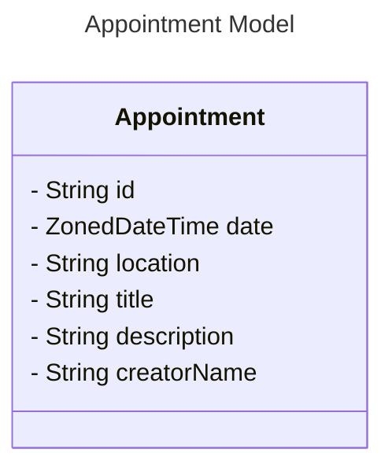
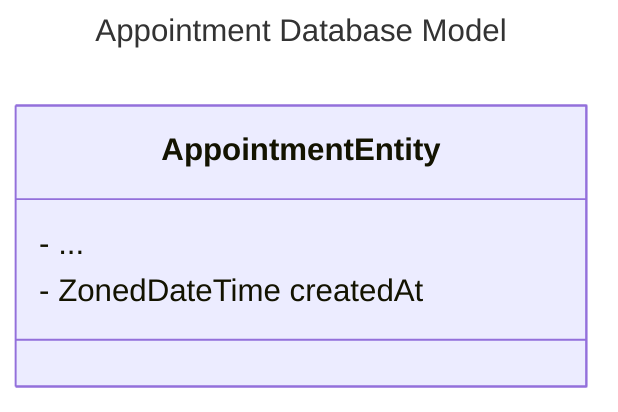
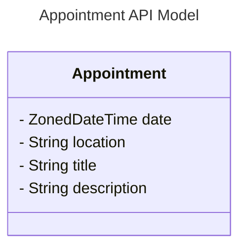
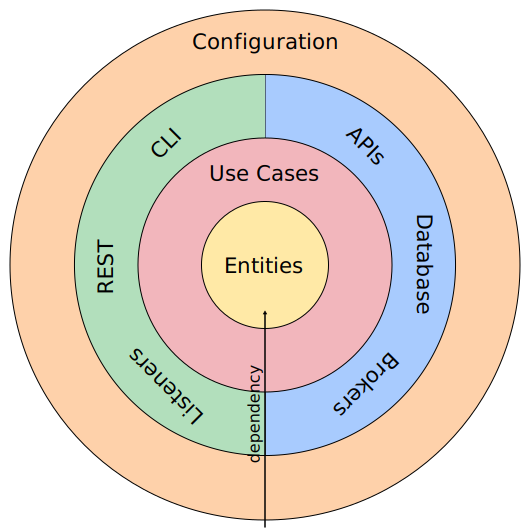
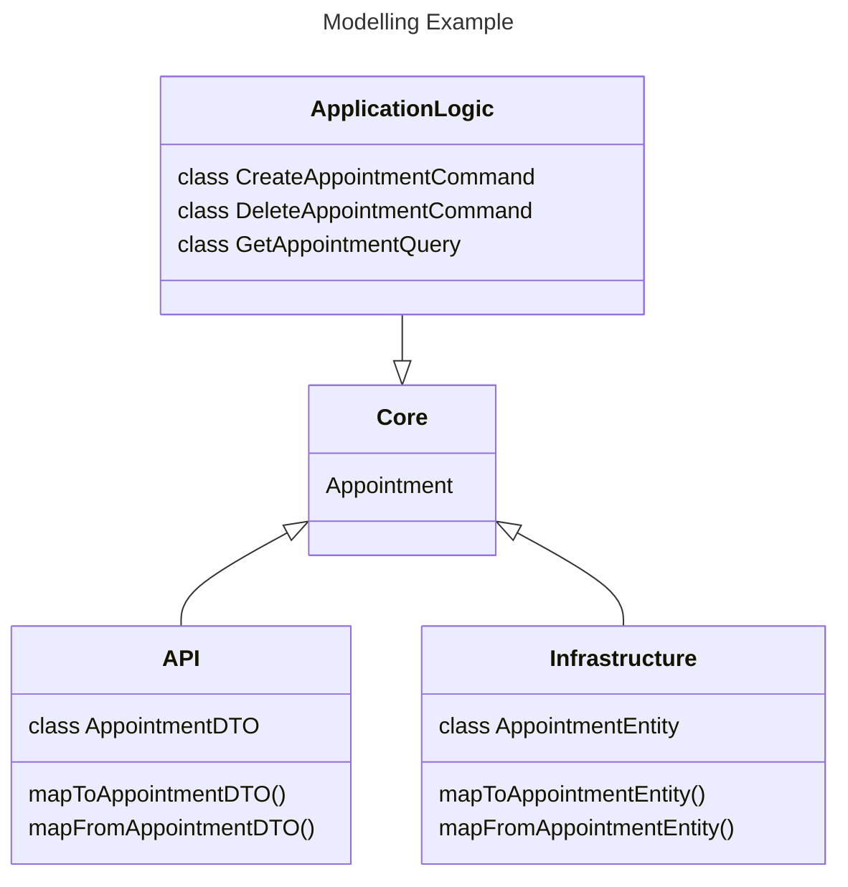
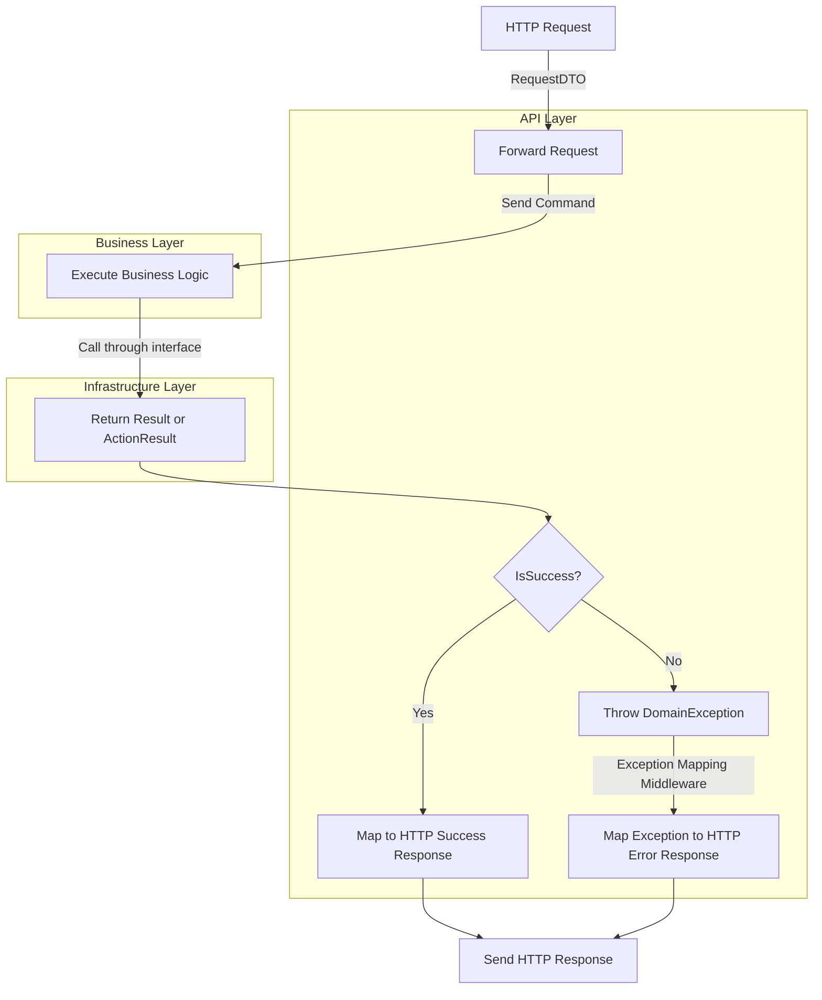

# Quarkus Workshop

Template for a Quarkus Workshop with the goal to create a Java Microservice with Quarkus, based on **Clean Architecture** with Gradle build system.

## Requirements

1. Java 21 ([Zulu 21](https://www.azul.com/))
2. VSCode, IntelliJ or whatever you prefer
3. Docker

-   Try not to use ChatGPT or other LLMs. Instead use google or quarkus docs etc...
-   You may also use existing github repositories as reference

## Initial Setup

1. Clone the repository to your local machine
2. Create two branches:
   1. solution/your-name (or pseudo name)
   2. development/your-name
3. Work in your "development" branch and when your done, create a Pull Request to your solution branch.

## Tasks (Part 1)

-   Implement a functioning Web-API in Quarkus, that:
    -   Can **Create**, **Delete** and **Get** an **Appointment**
    -   Stores data in a (temporary) database (PostgreSQL with docker)
    -   Has at least one Integration Test, that executes a whole GET workflow
-   Separate your code into the layers: API, Business, Core, Infrastructure
    -   Put your classes in the correct layers
    -   ArchitectureTests are given. They must pass during testing.
-   Implement mappers to communicate between the layers: API --> Business <-- Infrastructure
-   Test your endpoints with Postman (or similar, like curl)

<details>
  <summary>If you are too fast, here are some optional tasks:</summary>

-   Implement GET and DELETE methods for multiple appointments at once.
-   Implement unittests for the business logic and the controllers.
-   Think about how Errors could be handled in a clean way.
    -   Error Codes must be available for debugging
    -   The caller of the API should get the error code and a short message.
    -   The caller must not see the detailed exception.
    -   Developers should be able to easily use the error handling in the code.
    -   Wrong useage and unhandled exceptions should be avoided by design.

</details>

### Models

The Appointment model should look like this:



### Additionally in the database there must be the field: **_createdAt_**



### When a user requests an appointment, the model must not contain the **_id_** nor the **_creatorName_** of the appointment!



## Tasks (Part 2)

Only view the following tasks after we have finished the first task all together!

<details>
  <summary>Click to expand</summary>

-   In the **docs** folder, you will find an implementation of a Result type. Please use this Result or ActionResult type where it makes sense.
-   Add good logging to methods, where you think it is relevant.
-   Add error handling so, that you do not have unhandled exceptions in the whole application.
-   (Optional) Desing and implement a good exception handling mechanism for the whole application.

</details>

## Additional Information

### Commands

| Description | Command                |
| ----------- | ---------------------- |
| Start Dev   | `./gradlew quarkusDev` |
| Build       | `./gradlew build`      |
| Test        | `./gradlew test`       |

## Important files and directories

|                 | File or directory                         | Additional Information                                                 |
| --------------- | ----------------------------------------- | ---------------------------------------------------------------------- |
| :coffee:        | src/                                      | All java code is located under the src directory.                      |
| :coffee:        | src/main/java/                            | This is the main project                                               |
| :coffee:        | src/test/java/                            | Java tests go here.                                                    |
| :fireworks:     | src/main/resources/application.properties | Main Quarkus configuration file.                                       |
| :bookmark_tabs: | src/main/resources/db                     | Database migration files                                               |
| :truck:         | build.gradle                              | Contains references to Gradle conventions and additional dependencies. |
| :truck:         | settings.gradle                           | Contains Gradle plugin configuration.                                  |
| :truck:         | gradlew, gradlew.bat, gradle/wrapper/     | The Gradle Wrapper automatically download the correct Gradle version.  |

## Important server paths

|                            | Path         | Description                     |
| -------------------------- | ------------ | ------------------------------- |
| :books:                    | `/api/...`   | Your Resources                  |
| :heart:                    | `/q/health`  | Health endpoints                |
| :chart_with_upwards_trend: | `/q/metrics` | Metrics endpoint                |
| :page_facing_up:           | `/q/openapi` | OpenAPI (Swaggerfile)           |
| :information_source:       | `/q/info`    | Build and runtime info          |
| :wrench:                   | `/q/dev-ui`  | Developer UI (only in dev mode) |

## Architecture

The goal is to create a Web-API that follows the [Clean Architecture](https://blog.cleancoder.com/uncle-bob/2012/08/13/the-clean-architecture.html) approach by Robert C Martin.

<p align="center">
  
  <p align="center">Clean Architecture Schema</p>
</p>

-   **<span style="color:orange">Core</span>**:

    -   Domain Objects: Represent your domain object
    -   Apply only logic that is applicable in general to the whole entity (e.g. validating the format of an hostname)
    -   Plain java objects: **no frameworks**, **no annotations**
    -   Utility methods
    -   Extensions

-   **<span style="color:red">Application Logic</span>**: Use Cases, Commands, Queries

    -   Define **<span style="color:purple">interfaces</span>** for the data that you need in order to apply some logic. Services from **<span style="color:blue">Infrastructure</span>** will implement the interface, but the logic doesn’t know where the data is coming from
    -   Represent your business actions, it’s what you can do with the application. Expect one use case for each business action
    -   Pure business logic, plain java (expect maybe some utils libraries like StringUtils)
    -   The use case doesn't know who triggered it and how the results are going to be presented (e.g. could be on a web page, or returned as json, or simply logged, etc.)
    -   Throws business exceptions

-   **<span style="color:blue">Infrastructure</span>**: I/O, Retrieve and store information

    -   Implement the **<span style="color:purple">interfaces</span>** defined by the use case
    -   Retrieve and store data from and to a number of sources (database, network devices, message bus, file system, 3rd parties, microservices etc.)
    -   Use whatever framework is most appropriate (they are going to be isolated here anyway)
    -   Contains mapper for mapping Data Access Objects/Entities (from database model) to and from Domain Objects (**<span style="color:orange">Core</span>**)
    -   Note: if using an ORM for database access, here you'd have another set of objects in order to represent the mapping to the tables (<span style="color:red">don't use the **core domain model** as they might be very different</span>)

-   **<span style="color:green">API</span>**: Access to the application

    -   Are ways to interact with the application/frontend, and typically involve a delivery mechanism (e.g. REST APIs, GraphQL, gRPC, scheduled jobs, GUI, other systems)
    -   Trigger a use case/command/query and convert the result to the appropriate format for the delivery mechanism
    -   Contains mapper for mapping Data Transfer Objects (DTOs) to and from Domain Objects (**<span style="color:orange">Core</span>**)

-   **<span style="color:darkorange">Configuration</span>**: Wires everything together

    -   Wires everything together: Configuration, Dependency Injection, Framework stuff
    -   Frameworks (e.g. for dependency injection) are isolated here
    -   Has the "dirty details" like Main class, web server configuration, datasource configuration, etc.

## Object Modelling & Terminology

In consideration of the diverse interfaces or clients our application interacts with, it is important to maintain a well-defined separation of the models transversing these boundaries. The database operates with a distinct data model, while REST clients expect a different model. To efficiently work with our own application logic, we are implementing a **domain model** solely dedicated to our application's internal operations. We then define additional models specifically crafted for external communication. Internal and external models have to be mapped to and from another.



### Domain

Domain Objects are, what we are using in our Application Logic. Ideally this model should never change, and only be extended. They are defined in **Core**. For better readability, we do not add a special suffix to it.

e.g. Appointment

### Data Transfer Objects (DTO)

DTOs are objects, which are used for the communication with external clients (REST clients, User Interfaces, other microservices) and are defined in the **API** layer. They are suffixed with "**DTO**"

e.g. AppointmentDTO

### Entities

Entities represent the model, which is defined in a data source, like a database. Oftentimes you receive this model from an Object-Relational Mapper (ORM) like JDBC. They are suffixed with "**Entity**"

e.g. AppointmentEntity

## Error Handling Concept

### Custom Result Type

To streamline error handling, we implemented a custom Result<T> type. This type is pivotal in maintaining a standardized approach to error management across the architectural boundaries (api -> business <- infrastructure).

-   `ActionResult`: Used when there is no return type.
-   `Result<T>`: Used when there is a return type.

### Business Layer

The business layer defines interfaces that are required by the core business logic. These interfaces are implemented by the infrastructure layer. Every method that crosses the boundaries between these layers **must** return either an `ActionResult` or a `Result<T>`.

### Infrastructure Layer

The infrastructure layer implements the interfaces defined in the business layer. It ensures that all operations comply with the expected return types, facilitating consistent error handling. Methods called accross boundaries **must** never throw exceptions. A `try/catch` block must always be used to ensure that.

### Error Handling Mechanism

When an operation fails, the `Result<T>` must contain an Exception that is derived from the `DomainException` type defined in our domain layer. This ensures that all errors are domain-specific and consistent. An exception, that is inheriting from the `DomainException` should always be annotated with the `@ResponseMappable(ErrorResponse)` annotation. This allows us to map all of our exceptions to the corresponding HTTP status code in the `api` layer.

-   `DomainException`: All custom exceptions inherit from this base class and are defined within the domain layer.
-   `@ResponseMappable` Annotation: Each DomainException is annotated with ResponseMappable(`ErrorResponse`)
-   `ErrorResponse` is an enum representing common HTTP error types. This annotation is required for mapping of domain-specific exceptions to appropriate HTTP responses.

### ErrorResponse Mapping

An exception, annotated with `@ResponseMappable(Status.NOT_FOUND)` will automatically be mapped by the `ExceptionHttpResponseMapper` in the `api` layer to the following HTTP Error Response:

```json
HTTP Error Response 404
{
    "statusCode": 404,
    "status": "Not found",
    "message": <Custom Debug message, when in Debug Mode>
}
```

### Data Flow Diagram for Error Handling



## Logging

To use a logger, annotate the class with `@lombok.extern.slf4j.Slf4j` and use the SLF4J logger with e.g.
`LOGGER.info("Hello!");`.

## Resources

-   Quarkus Website: https://quarkus.io/
-   All Configuration Options: https://quarkus.io/guides/all-config
-   Gradle: https://docs.gradle.org/current/userguide/userguide.html
